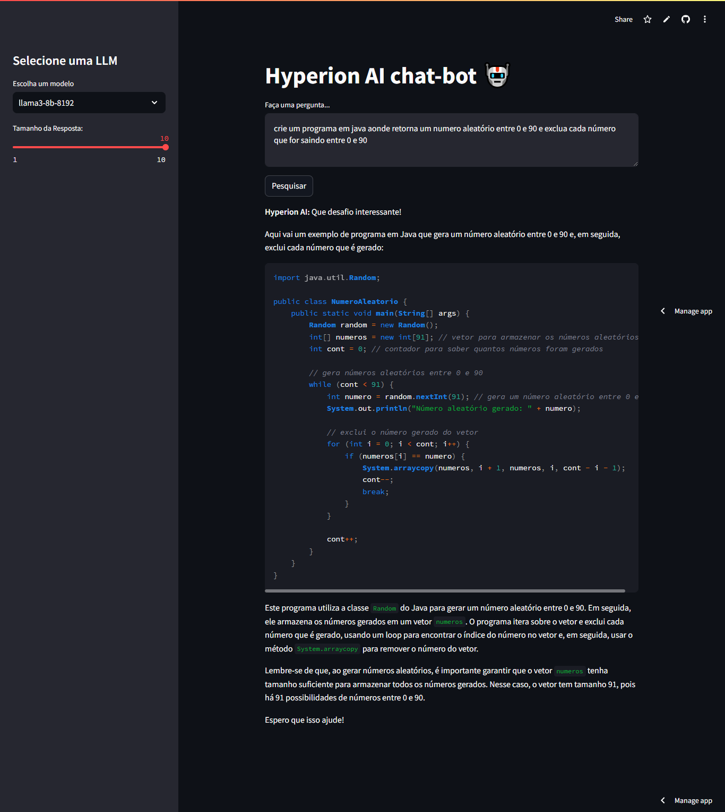

# Hyperion Tech Chatbot 🤖

Este projeto é um **chatbot em Python** desenvolvido para ajudar usuários a resolverem problemas de código utilizando a **API da Groq**. O chatbot é capaz de responder perguntas em **Português Brasileiro**, fornecendo respostas detalhadas e informativas sobre diversos tópicos de programação.

## Funcionalidades

- **Integração com a Groq API**: O chatbot usa a API da Groq para processar e gerar respostas com base nas perguntas dos usuários.
- **Respostas Detalhadas e Ilimitadas**: O modelo é configurado para fornecer respostas detalhadas sem limitações de tamanho, ajudando a solucionar dúvidas de programação com informações ricas.
- **Memória de Conversação**: O chatbot mantém o histórico da conversa para dar continuidade às respostas, permitindo um contexto mais rico nas interações.
- **Interface Interativa**: Desenvolvido com Streamlit, o chatbot possui uma interface web amigável e fácil de usar, com um botão de "Pesquisar" para facilitar o envio de perguntas.

## Como Usar

### Pré-requisitos

- **Python 3.8+**
- Biblioteca `streamlit`
- Biblioteca `langchain`
- Biblioteca `langchain_groq`
- **Groq API Key**: Uma chave de API válida da **Groq** para acessar o modelo de linguagem.

### Instalação

Link do projeto:
```bash
    https://hyperion-ai-deploy.streamlit.app/
```

1. Clone o repositório para o seu ambiente local:
    ```bash
    git clone https://github.com/seu-usuario/hyperion-chatbot.git
    cd hyperion-chatbot
    ```
    

2. Crie e ative um ambiente virtual:
    ```bash
    python -m venv venv
    source venv/bin/activate  # No Windows, use `venv\Scripts\activate`
    ```

3. Instale as dependências do projeto:
    ```bash
    pip install -r requirements.txt
    ```

4. Crie um arquivo `.env` e adicione sua chave da API Groq:
    ```
    GROQ_API_KEY=your_groq_api_key_here
    ```

### Executando o Projeto

1. Para rodar o chatbot, execute o seguinte comando:
    ```bash
    streamlit run main.py
    ```

2. Acesse o chatbot na URL fornecida no terminal (geralmente `http://localhost:8501`).

3. Faça uma pergunta relacionada a problemas de código e o chatbot responderá com soluções e dicas!


## Tecnologias Utilizadas

- **Python**
- **Streamlit**: Framework para criar aplicações web interativas em Python.
- **Groq API**: API de linguagem natural utilizada para gerar respostas.
- **Langchain**: Ferramenta para trabalhar com cadeias de processamento de linguagem natural.

## Contribuições

Contribuições são bem-vindas! Sinta-se à vontade para abrir **issues** ou enviar **pull requests**.

## Licença

Este projeto está licenciado sob os termos da licença MIT. Veja o arquivo [LICENSE](LICENSE) para mais detalhes.

---

Desenvolvido com 💻 por @Henrydev_ 

